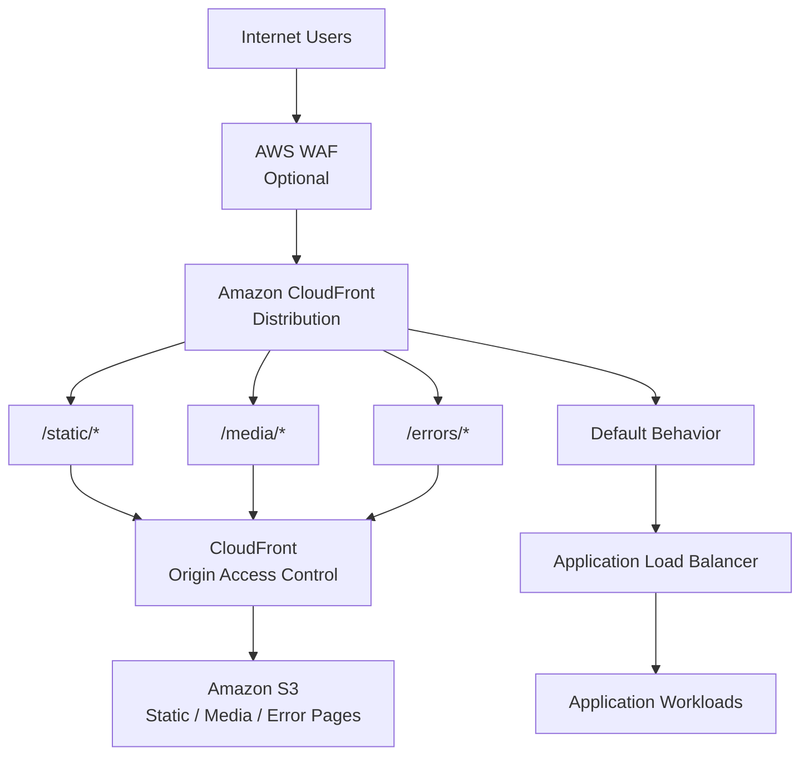
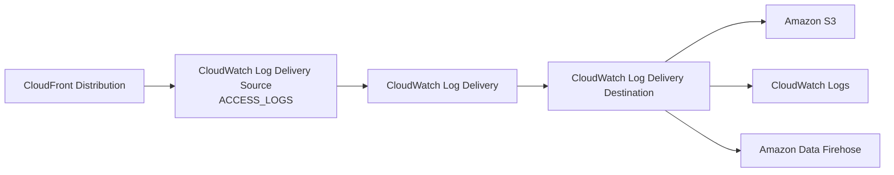
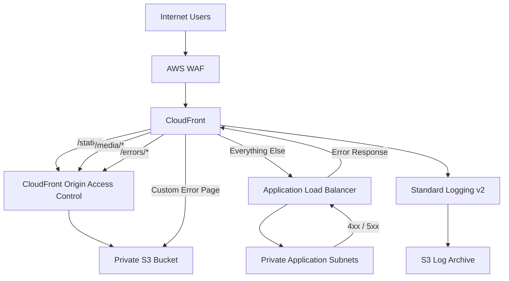

# Terraform AWS CloudFront Module

A production-oriented Terraform module for provisioning reusable **Amazon CloudFront distributions** with support for multiple origins, path-based cache behavior routing, custom error responses, origin failover groups, HTTPS/custom domains, AWS WAF integration, and CloudFront **Standard Logging v2**.

The module is intentionally designed around **composition rather than infrastructure ownership**. It creates and manages the CloudFront distribution and its Standard Logging v2 delivery configuration while consuming externally managed resources such as S3 buckets, Application Load Balancers, ACM certificates, WAF Web ACLs, cache policies, origin request policies, response headers policies, and logging destinations.

---

## Table of Contents

* [Overview](#overview)
* [Architecture](#architecture)
* [Core Design](#core-design)
* [Supported Capabilities](#supported-capabilities)
* [Module Structure](#module-structure)
* [Requirements](#requirements)
* [Usage](#usage)
* [Multiple Origins](#multiple-origins)
* [Cache Behaviors](#cache-behaviors)
* [Static and Media Asset Routing](#static-and-media-asset-routing)
* [Custom Error Responses](#custom-error-responses)
* [Origin Groups and Failover](#origin-groups-and-failover)
* [HTTPS and Custom Domains](#https-and-custom-domains)
* [AWS WAF Integration](#aws-waf-integration)
* [Standard Logging v2](#standard-logging-v2)
* [Logging Architecture](#logging-architecture)
* [Variable Reference](#variable-reference)
* [Validation Strategy](#validation-strategy)
* [Outputs](#outputs)
* [Complete Example](#complete-example)
* [Security Considerations](#security-considerations)
* [Cost Considerations](#cost-considerations)
* [Operational Considerations](#operational-considerations)
* [Module Design Decisions](#module-design-decisions)
* [Deployment Workflow](#deployment-workflow)
* [Importing Existing Resources](#importing-existing-resources)
* [Troubleshooting](#troubleshooting)
* [Recommended Production Pattern](#recommended-production-pattern)
* [Design Philosophy](#design-philosophy)
* [Versioning](#versioning)
* [License](#license)

---

# Overview

Amazon CloudFront is an AWS content delivery network (CDN) that provides globally distributed delivery of web applications, APIs, static assets, media, and other HTTP/HTTPS content.

This module provides a reusable Terraform abstraction around:

```text
aws_cloudfront_distribution
```

The module is designed to support architectures where a single CloudFront distribution fronts multiple backend systems.

A typical production application may use:

```text
                         Internet Users
                              │
                              │ HTTPS
                              ▼
                     ┌─────────────────┐
                     │   CloudFront    │
                     │   Distribution  │
                     └────────┬────────┘
                              │
             ┌────────────────┼────────────────┐
             │                │                │
             ▼                ▼                ▼
        /static/*         /media/*          /*
             │                │                │
             ▼                ▼                ▼
            S3               S3               ALB
        Static Assets    Media Assets    Application
                                              │
                                              ▼
                                           Django
                                           / App
```

The distribution therefore acts as the **single public entry point** while different request paths are routed to the appropriate backend.

---

# Architecture

## High-Level Architecture

The module supports a multi-origin architecture in which CloudFront determines the destination of a request using ordered cache behaviors and a default cache behavior.



The important routing rule is:

```text
/static/*  → S3
/media/*   → S3
/errors/*  → S3
/*         → ALB
```

The default behavior therefore handles the application while specific asset and error-page paths are routed to S3.

---

# Core Design

The module follows several major principles.

## 1. Multiple Origins

The module accepts a map of origins.

A distribution can therefore contain:

* S3 origins
* Application Load Balancer origins
* NLB/custom HTTP origins
* Other supported custom HTTP origins

Origins are identified using stable map keys.

Example:

```hcl
origins = {
  static = {
    ...
  }

  application = {
    ...
  }
}
```

The resulting logical origin IDs are:

```text
static
application
```

Cache behaviors can reference them directly:

```hcl
target_origin_id = "static"
```

or:

```hcl
target_origin_id = "application"
```

This is preferable to positional indexes because adding or removing an origin does not change the identity of the remaining origins.

---

## 2. Default Application Origin

The default cache behavior should normally point to the application origin.

For example:

```hcl
default_cache_behavior = {
  target_origin_id = "application"
}
```

This means:

```text
Every request
     │
     ▼
CloudFront
     │
     ├── matches ordered behavior → specialized origin
     │
     └── no match → application origin
```

For a web application:

```text
/static/* → S3
/media/*  → S3
/errors/* → S3
/*        → ALB
```

This is particularly useful for Django and other application frameworks where the majority of requests are dynamic application requests.

---

# Supported Capabilities

The module currently supports:

* Multiple CloudFront origins
* S3 origins
* Custom HTTP origins
* Application Load Balancer origins
* Origin Access Control for S3
* S3 Origin Access Identity compatibility
* Default cache behavior
* Ordered cache behaviors
* Path-based origin routing
* Static asset routing
* Media asset routing
* Custom error-page routing
* CloudFront custom error responses
* Configurable error caching TTLs
* Configurable viewer-facing error status codes
* CloudFront origin groups
* Origin failover
* Custom domain aliases
* ACM certificates
* HTTPS enforcement
* TLS protocol policy
* IPv6
* HTTP/1.1
* HTTP/2
* HTTP/2 + HTTP/3
* HTTP/3
* AWS WAF integration
* Compression
* AWS-managed cache policies
* Caller-supplied cache policies
* Caller-supplied origin request policies
* Caller-supplied response headers policies
* CloudFront Standard Logging v2
* S3 logging destinations
* CloudWatch Logs destinations
* Amazon Data Firehose destinations
* Custom tags
* Extensive Terraform variable validation
* Cross-resource validation through Terraform lifecycle preconditions

---

# Module Structure

```text
cloudfront/
│
├── .gitignore
├── README.md
├── versions.tf
├── variables.tf
├── locals.tf
├── main.tf
├── outputs.tf
│
└── examples/
    └── complete/
        ├── main.tf
        ├── variables.tf
        └── outputs.tf
```

## File Responsibilities

### `versions.tf`

Defines:

* Terraform version requirements
* AWS provider requirements

### `variables.tf`

Contains:

* User-configurable module inputs
* Input types
* Defaults
* Validation rules
* Custom error-response configuration

### `locals.tf`

Contains internal values derived from module inputs.

### `main.tf`

Contains:

* CloudFront distribution
* Origins
* Origin groups
* Cache behaviors
* Custom error responses
* Viewer configuration
* WAF association
* Standard Logging v2 resources

### `outputs.tf`

Exposes useful CloudFront and logging attributes to callers.

### `examples/complete/`

Provides a complete reference implementation demonstrating:

* Multiple origins
* S3 origin
* Application origin
* Static asset routing
* Media asset routing
* Custom error pages
* HTTPS/custom domain configuration
* WAF integration
* Standard Logging v2

---

# Requirements

## Terraform

```text
>= 1.6.0
```

## AWS Provider

```text
>= 6.0.0, < 7.0.0
```

The module is intentionally constrained to the AWS provider major version 6 series to avoid unexpected breaking changes from a future provider major release.

---

# Usage

A minimal CloudFront distribution can be instantiated with one origin.

```hcl
module "cloudfront" {
  source = "git::https://github.com/iamwonodi/terraform-aws-cloudfront.git?ref=v1.1.0"

  comment = "Production CloudFront distribution"

  origins = {
    application = {
      domain_name = "example-alb.eu-west-1.elb.amazonaws.com"
      origin_type = "custom"

      custom_origin_config = {
        origin_protocol_policy = "https-only"
        origin_ssl_protocols   = ["TLSv1.2"]
      }
    }
  }

  default_cache_behavior = {
    target_origin_id = "application"
  }
}
```

The important relationship is:

```text
origins
   │
   └── application
          │
          ▼
default_cache_behavior
          │
          └── target_origin_id = "application"
```

The `target_origin_id` must reference an origin defined in `origins`.

---

# Multiple Origins

One of the primary capabilities of this module is support for multiple CloudFront origins.

A distribution can combine an ALB and S3:

```text
                         CloudFront
                             │
              ┌──────────────┴──────────────┐
              │                             │
          Specific Paths               Everything Else
              │                             │
              ▼                             ▼
             S3                            ALB
```

Example:

```hcl
origins = {
  static = {
    domain_name = var.s3_origin_domain_name
    origin_type = "s3"

    origin_access_control_id = var.s3_origin_access_control_id

    s3_origin_config = {}
  }

  application = {
    domain_name = var.application_origin_domain_name
    origin_type = "custom"

    custom_origin_config = {
      http_port              = 80
      https_port             = 443
      origin_protocol_policy = "https-only"
      origin_ssl_protocols   = ["TLSv1.2"]
    }
  }
}
```

The distribution now contains two origins:

```text
static
application
```

---

# Cache Behaviors

Multiple origins become useful when combined with CloudFront cache behaviors.

CloudFront has:

1. One default cache behavior
2. Zero or more ordered cache behaviors

The default behavior handles requests that do not match an ordered behavior.

Example:

```hcl
default_cache_behavior = {
  target_origin_id = "application"
}

ordered_cache_behaviors = [
  {
    path_pattern     = "/static/*"
    target_origin_id = "static"
  }
]
```

The request flow becomes:

```text
Request
   │
   ▼
CloudFront
   │
   ├── /static/*
   │       │
   │       ▼
   │      S3
   │
   └── Everything else
           │
           ▼
          ALB
```

This makes the default behavior the application path while ordered behaviors selectively route specialized paths.

---

# Static and Media Asset Routing

A common production pattern for Django and other web applications is to keep static and media content in S3 while sending application requests to an ALB.

The recommended routing model is:

```text
/static/*  → S3
/media/*   → S3
/*         → ALB
```

For example:

```text
https://example.com/static/css/site.css
                              │
                              ▼
                             S3

https://example.com/static/js/app.js
                              │
                              ▼
                             S3

https://example.com/media/uploads/image.jpg
                              │
                              ▼
                             S3

https://example.com/login/
                              │
                              ▼
                             ALB

https://example.com/api/users
                              │
                              ▼
                             ALB

https://example.com/dashboard/
                              │
                              ▼
                             ALB
```

Example:

```hcl
ordered_cache_behaviors = [
  {
    path_pattern     = "/static/*"
    target_origin_id = "static"

    viewer_protocol_policy = "redirect-to-https"

    allowed_methods = [
      "GET",
      "HEAD",
      "OPTIONS"
    ]

    cached_methods = [
      "GET",
      "HEAD"
    ]
  },

  {
    path_pattern     = "/media/*"
    target_origin_id = "static"

    viewer_protocol_policy = "redirect-to-https"

    allowed_methods = [
      "GET",
      "HEAD",
      "OPTIONS"
    ]

    cached_methods = [
      "GET",
      "HEAD"
    ]
  }
]
```

The application remains the default origin:

```hcl
default_cache_behavior = {
  target_origin_id = "application"
}
```

---

# Custom Error Responses

The module supports CloudFront **custom error responses**.

This capability allows CloudFront to intercept configured HTTP errors returned by an origin and serve a custom error page instead.

For example:

```text
ALB
 │
 │ HTTP 404
 ▼
CloudFront
 │
 │ Custom Error Response
 ▼
S3
 │
 │ /errors/404.html
 ▼
CloudFront
 │
 ▼
User
```

This is different from ordinary cache behavior routing.

Cache behaviors determine **where a request normally goes**.

Custom error responses determine **what CloudFront does after an origin returns a configured error status**.

---

# Custom Error Page Architecture

For an application using ALB and S3, the recommended architecture is:

```text
                              Internet
                                  │
                                  ▼
                         ┌─────────────────┐
                         │   CloudFront    │
                         └────────┬────────┘
                                  │
             ┌────────────────────┼────────────────────┐
             │                    │                    │
             ▼                    ▼                    ▼
        /static/*             /media/*             /*
             │                    │                    │
             └──────────┬─────────┘                    │
                        │                              │
                        ▼                              ▼
                       S3                             ALB
                        │                              │
                        │                              ▼
                        │                         Application
                        │                              │
                        │                         ┌────┴─────┐
                        │                         │          │
                        │                        2xx       4xx/5xx
                        │                                    │
                        │                                    ▼
                        │                               CloudFront
                        │                                    │
                        │                         Custom Error Response
                        │                                    │
                        ▼                                    ▼
                       S3 ◄──────────────────────── /errors/*.html
```

The S3 bucket can contain:

```text
static/
media/
errors/
```

For example:

```text
static/css/site.css
static/js/app.js
static/images/logo.svg

media/uploads/profile.jpg
media/uploads/document.pdf

errors/404.html
errors/500.html
errors/502.html
errors/503.html
errors/504.html
```

S3 uses object keys rather than traditional filesystem directories. Therefore these are logical prefixes rather than folders that must be manually created as empty directories.

---

# Configuring Custom Error Responses

The module exposes:

```hcl
custom_error_responses
```

Example:

```hcl
custom_error_responses = [
  {
    error_code            = 404
    response_code         = 404
    response_page_path    = "/errors/404.html"
    error_caching_min_ttl = 60
  },

  {
    error_code            = 500
    response_code         = 500
    response_page_path    = "/errors/500.html"
    error_caching_min_ttl = 10
  },

  {
    error_code            = 502
    response_code         = 502
    response_page_path    = "/errors/502.html"
    error_caching_min_ttl = 10
  },

  {
    error_code            = 503
    response_code         = 503
    response_page_path    = "/errors/503.html"
    error_caching_min_ttl = 10
  },

  {
    error_code            = 504
    response_code         = 504
    response_page_path    = "/errors/504.html"
    error_caching_min_ttl = 10
  }
]
```

The module dynamically creates the corresponding CloudFront custom error-response blocks.

If the variable is omitted, the default is:

```hcl
custom_error_responses = []
```

Therefore custom error interception is **opt-in**.

---

# Error Response Flow

Consider this request:

```text
https://example.com/products/123
```

Because `/products/123` does not match `/static/*`, `/media/*`, or another specialized behavior, it reaches the default application origin:

```text
User
 │
 ▼
CloudFront
 │
 ▼
ALB
 │
 ▼
Application
```

Suppose the application returns:

```text
HTTP 404
```

The response travels back:

```text
Application
    │
    ▼
   ALB
    │
    │ 404
    ▼
CloudFront
```

CloudFront sees that the configured origin returned an HTTP 404 and checks its custom error-response configuration.

If configured:

```text
404
 │
 └── /errors/404.html
```

CloudFront retrieves the configured error page from the appropriate origin and returns it to the viewer.

The viewer therefore receives:

```text
HTTP 404
```

along with the custom HTML body.

This allows the application to preserve the correct HTTP status while presenting a user-friendly page.

---

# Custom Error Response vs Origin Failover

Custom error responses and CloudFront origin groups are **not the same feature**.

## Custom Error Response

Used when the goal is:

```text
Origin returns error
        │
        ▼
CloudFront displays custom error page
```

Example:

```text
ALB → 404
        │
        ▼
CloudFront
        │
        ▼
S3 /errors/404.html
```

## Origin Failover

Used when the goal is:

```text
Primary origin fails
        │
        ▼
CloudFront uses another origin
```

Example:

```text
Primary ALB
    │
    │ failure
    ▼
Failover S3
```

These features should not be confused.

A custom error page is primarily a **viewer experience mechanism**.

Origin failover is an **origin availability mechanism**.

---

# `/errors/*` Cache Behavior

When custom error pages are stored in an S3 origin that is separate from the application origin, the error-page path must be routed to the origin containing those files.

For the architecture in this module:

```text
/static/*  → S3
/media/*   → S3
/errors/*  → S3
/*         → ALB
```

Example:

```hcl
ordered_cache_behaviors = [
  {
    path_pattern     = "/static/*"
    target_origin_id = "static"
  },

  {
    path_pattern     = "/media/*"
    target_origin_id = "static"
  },

  {
    path_pattern     = "/errors/*"
    target_origin_id = "static"
  }
]
```

The exact cache behavior settings should be selected according to the application's caching requirements.

The important relationship is:

```text
custom_error_responses
        │
        │ response_page_path
        ▼
/errors/404.html
        │
        ▼
/errors/* cache behavior
        │
        ▼
S3 origin
```

---

# Error Page Storage

The CloudFront module **does not create or populate the S3 bucket**.

The caller is responsible for managing the content.

A suitable bucket layout is:

```text
S3 Bucket
│
├── static/
│   ├── css/
│   ├── js/
│   └── images/
│
├── media/
│   └── uploads/
│
└── errors/
    ├── 404.html
    ├── 500.html
    ├── 502.html
    ├── 503.html
    └── 504.html
```

The folders do not need to be manually created as empty S3 directories.

For example, uploading:

```text
errors/404.html
```

creates the `errors/` prefix automatically.

---

# Error Caching

CloudFront can cache custom error responses.

The module therefore exposes:

```hcl
error_caching_min_ttl
```

Example:

```hcl
{
  error_code            = 503
  response_code         = 503
  response_page_path    = "/errors/503.html"
  error_caching_min_ttl = 10
}
```

Short TTLs are generally more appropriate for transient application errors such as:

```text
500
502
503
504
```

because the application may recover shortly after the error occurs.

A longer TTL can be appropriate for persistent client errors such as:

```text
404
```

depending on the application.

Example strategy:

```text
404 → 60 seconds
500 → 10 seconds
502 → 10 seconds
503 → 10 seconds
504 → 10 seconds
```

These values are examples rather than mandatory recommendations.

---

# Preserving the HTTP Status Code

The module allows the response status code to be configured independently.

For example:

```hcl
{
  error_code         = 404
  response_code      = 404
  response_page_path = "/errors/404.html"
}
```

The viewer receives:

```text
HTTP 404
```

while seeing the custom error page.

This is generally preferable to converting an actual error into:

```text
HTTP 200
```

because clients, search engines, monitoring systems, and other consumers can still correctly identify the request as unsuccessful.

---

# Dead Subdomains and CloudFront Errors

CloudFront can provide a custom error page when a request reaches the distribution and the configured origin returns an applicable error.

However, CloudFront cannot intercept a hostname that never reaches CloudFront.

For example:

```text
dead.example.com
```

If DNS does not resolve the hostname:

```text
User
 │
 ▼
DNS
 │
 └── No DNS record
       │
       ▼
     Failure
```

CloudFront is never involved.

For a hostname to reach CloudFront, DNS must route it appropriately and the hostname must be configured for the distribution.

Therefore:

> A "dead subdomain" is only handled by CloudFront if the request actually reaches the CloudFront distribution and produces an error that CloudFront is configured to handle.

---

# Default Cache Behavior

The default cache behavior is mandatory because CloudFront requires a default behavior.

For an application-backed distribution:

```hcl
default_cache_behavior = {
  target_origin_id       = "application"
  viewer_protocol_policy = "redirect-to-https"

  allowed_methods = [
    "GET",
    "HEAD",
    "OPTIONS",
    "POST",
    "PUT",
    "PATCH",
    "DELETE"
  ]

  cached_methods = [
    "GET",
    "HEAD"
  ]

  compress = true
}
```

The default behavior handles all requests not matched by an ordered cache behavior.

---

# Ordered Cache Behaviors

Ordered behaviors allow specific URL paths to be handled differently.

Example:

```hcl
ordered_cache_behaviors = [
  {
    path_pattern     = "/static/*"
    target_origin_id = "static"
  },

  {
    path_pattern     = "/media/*"
    target_origin_id = "static"
  },

  {
    path_pattern     = "/errors/*"
    target_origin_id = "static"
  }
]
```

The resulting routing is:

```text
/static/*  → S3
/media/*   → S3
/errors/*  → S3
/*         → ALB
```

CloudFront evaluates ordered behaviors according to their configured order.

The caller should therefore keep behavior ordering deliberate.

---

# HTTP Method Validation

The module supports the CloudFront HTTP methods:

```text
GET
HEAD
OPTIONS
PUT
POST
PATCH
DELETE
```

The module also validates that:

```text
cached_methods ⊆ allowed_methods
```

For example, this is invalid:

```hcl
allowed_methods = [
  "GET",
  "HEAD"
]

cached_methods = [
  "OPTIONS"
]
```

because `OPTIONS` is not an allowed method.

---

# Origin Groups and Failover

Origin groups provide a different capability from ordinary multiple origins.

Multiple origins are normally used for routing:

```text
/static/* → S3
/*        → ALB
```

Origin groups are used for failover:

```text
               Origin Group
                   │
           ┌───────┴───────┐
           │               │
        Primary         Failover
           │               │
           ▼               ▼
          ALB             S3
```

Example:

```hcl
origin_groups = {
  application_failover = {
    primary_origin_id  = "application"
    failover_origin_id = "static"

    failover_status_codes = [
      500,
      502,
      503,
      504
    ]
  }
}
```

The primary origin is used first.

If CloudFront receives one of the configured failover status codes, it can use the failover origin.

Origin groups should therefore not be confused with custom error responses.

---

# HTTPS and Custom Domains

The module supports optional custom domain aliases.

Example:

```hcl
aliases = [
  "example.com",
  "www.example.com"
]
```

When aliases are configured, an ACM certificate must also be supplied:

```hcl
acm_certificate_arn = var.acm_certificate_arn
```

The certificate must satisfy CloudFront's certificate requirements.

The module validates the relationship between aliases and the ACM certificate.

---

# Viewer Protocol Policy

The module supports:

```text
allow-all
redirect-to-https
https-only
```

The recommended production configuration is normally:

```hcl
viewer_protocol_policy = "redirect-to-https"
```

or:

```hcl
viewer_protocol_policy = "https-only"
```

depending on the application's requirements.

---

# TLS Configuration

The module exposes:

```hcl
minimum_protocol_version
```

The default is:

```text
TLSv1.2_2021
```

This should normally be retained for modern production deployments unless compatibility requirements dictate otherwise.

---

# HTTP Version

The module supports:

```text
http1.1
http2
http2and3
http3
```

The default is:

```hcl
http_version = "http2"
```

HTTP/3 can be enabled when appropriate:

```hcl
http_version = "http3"
```

---

# IPv6

IPv6 is enabled by default:

```hcl
is_ipv6_enabled = true
```

It can be disabled if a specific compatibility requirement exists:

```hcl
is_ipv6_enabled = false
```

---

# AWS WAF Integration

The module does not create the WAF Web ACL.

Instead, it accepts an existing Web ACL ARN:

```hcl
web_acl_id = var.web_acl_id
```

This allows the WAF policy to have its own lifecycle and potentially be shared between multiple distributions or resources.

Architecture:

```text
                    Internet
                       │
                       ▼
                    AWS WAF
                       │
                 Allowed Requests
                       │
                       ▼
                  CloudFront
```

This separation keeps security policy management independent from CDN lifecycle management.

---

# Standard Logging v2

The module uses **CloudFront Standard Logging v2** rather than the legacy CloudFront logging configuration.

Logging v2 is implemented using the AWS CloudWatch Logs delivery architecture.

The module creates:

```text
aws_cloudwatch_log_delivery_source
aws_cloudwatch_log_delivery_destination
aws_cloudwatch_log_delivery
```

The destination itself remains externally managed.

---

# Logging Architecture

The logging pipeline is:



This architecture separates:

* CloudFront log production
* Delivery configuration
* Final destination

---

# Logging Destination Ownership

The module does **not** create the destination infrastructure.

For example, when using S3 logging, the caller is responsible for the bucket.

```text
Caller
  │
  └── S3 Bucket
          │
          ▼
CloudFront Module
  │
  ├── Log Delivery Source
  ├── Log Delivery Destination
  └── Log Delivery
```

This prevents the CloudFront module from taking ownership of unrelated storage infrastructure.

The same principle applies when the destination is:

* CloudWatch Logs
* Amazon Data Firehose

---

# Logging Configuration Example

```hcl
logging = {
  enabled = true

  source_name      = "cloudfront-access-logs-source"
  destination_name = "cloudfront-access-logs-destination"

  destination_type = "s3"
  destination_arn  = var.logging_destination_arn

  region = "us-east-1"

  output_format = "json"

  field_delimiter = ","

  record_fields = [
    "date",
    "time",
    "x-edge-location",
    "sc-bytes",
    "c-ip",
    "cs-method",
    "cs(Host)",
    "cs-uri-stem",
    "sc-status",
    "cs(Referer)",
    "cs(User-Agent)",
    "cs-uri-query",
    "cs(Cookie)",
    "x-edge-result-type",
    "x-edge-request-id",
    "x-host-header",
    "cs-protocol",
    "time-taken"
  ]

  s3 = {
    suffix_path = "/cloudfront/{DistributionId}/{yyyy}/{MM}/{dd}/{HH}"
  }
}
```

---

# Logging Destinations

The module supports:

```text
s3
cloudwatch_logs
firehose
```

The destination resource must already exist.

For S3:

```hcl
destination_type = "s3"
```

For CloudWatch Logs:

```hcl
destination_type = "cloudwatch_logs"
```

For Firehose:

```hcl
destination_type = "firehose"
```

---

# Logging Output Format

The module exposes the Standard Logging v2 output format configuration.

Supported formats include:

```text
json
plain
w3c
raw
parquet
```

Parquet is intended for S3-based delivery.

---

# Variable Reference

## `comment`

```text
Type: string
Required: yes
```

Description of the CloudFront distribution.

Example:

```hcl
comment = "Production web application CDN"
```

---

## `origins`

```text
Type: map(object)
Required: yes
```

Defines all CloudFront origins.

At least one origin must be configured.

Each origin contains attributes such as:

```text
domain_name
origin_type
origin_path
origin_access_control_id
s3_origin_config
custom_origin_config
```

Supported origin types include:

```text
s3
custom
```

---

## `default_cache_behavior`

```text
Type: object
Required: yes
```

Defines the default CloudFront behavior.

Important attributes include:

```text
target_origin_id
viewer_protocol_policy
allowed_methods
cached_methods
cache_policy_id
origin_request_policy_id
response_headers_policy_id
compress
```

The default behavior should normally point to the application's origin when CloudFront is being used as the front door for a web application.

---

## `ordered_cache_behaviors`

```text
Type: list(object)
Default: []
```

Defines path-specific cache behaviors.

Example:

```hcl
ordered_cache_behaviors = [
  {
    path_pattern     = "/static/*"
    target_origin_id = "static"
  },

  {
    path_pattern     = "/media/*"
    target_origin_id = "static"
  }
]
```

---

## `custom_error_responses`

```text
Type: list(object)
Default: []
```

Defines CloudFront custom error responses.

Each object can configure:

```text
error_code
response_code
response_page_path
error_caching_min_ttl
```

Example:

```hcl
custom_error_responses = [
  {
    error_code            = 404
    response_code         = 404
    response_page_path    = "/errors/404.html"
    error_caching_min_ttl = 60
  }
]
```

The default:

```hcl
custom_error_responses = []
```

means no custom CloudFront error responses are configured.

---

## `origin_groups`

```text
Type: map(object)
Default: {}
```

Defines optional failover origin groups.

Each group requires:

```text
primary_origin_id
failover_origin_id
failover_status_codes
```

---

## `enabled`

```text
Type: bool
Default: true
```

Controls whether the distribution is enabled.

---

## `is_ipv6_enabled`

```text
Type: bool
Default: true
```

Controls IPv6 support.

---

## `http_version`

```text
Type: string
Default: "http2"
```

Valid values:

```text
http1.1
http2
http2and3
http3
```

---

## `price_class`

```text
Type: string
Default: "PriceClass_100"
```

Valid values:

```text
PriceClass_All
PriceClass_200
PriceClass_100
```

---

## `default_root_object`

```text
Type: string
Default: "index.html"
```

Object returned when the distribution root is requested.

---

## `aliases`

```text
Type: list(string)
Default: []
```

Alternate domain names.

Example:

```hcl
aliases = [
  "example.com",
  "www.example.com"
]
```

---

## `acm_certificate_arn`

```text
Type: string
Default: null
```

ACM certificate used for custom CloudFront aliases.

---

## `minimum_protocol_version`

```text
Type: string
Default: "TLSv1.2_2021"
```

Minimum TLS security policy for viewer connections.

---

## `web_acl_id`

```text
Type: string
Default: null
```

Optional AWS WAF Web ACL ARN.

---

## `logging`

```text
Type: object
Default: {}
```

Controls CloudFront Standard Logging v2.

Important attributes include:

```text
enabled
source_name
destination_name
destination_type
destination_arn
region
output_format
field_delimiter
record_fields
s3
```

---

## `tags`

```text
Type: map(string)
Default: {}
```

Additional tags applied to the CloudFront distribution and supported logging resources.

---

# Validation Strategy

The module intentionally performs validation at several levels.

## Input Validation

Simple constraints are validated directly inside `variables.tf`.

Examples include:

* Allowed origin types
* Valid HTTP methods
* Valid viewer protocol policies
* Valid price classes
* Valid HTTP versions
* Valid TLS policies
* Valid ports
* Valid timeout ranges
* Non-empty domains
* Unique aliases
* Valid failover status codes
* Valid custom error configuration
* Non-negative error caching TTLs
* Valid error-page paths

---

# Cross-Variable Validation

Some relationships cannot be safely validated by examining one variable independently.

These are handled through Terraform lifecycle preconditions.

## Cache Behavior → Origin

```text
target_origin_id
        │
        ▼
must exist in
        │
        ▼
origins
```

## Origin Group → Origins

```text
primary_origin_id
        │
        ▼
must exist in origins
```

and:

```text
failover_origin_id
        │
        ▼
must exist in origins
```

## Alias → ACM Certificate

```text
aliases != []
       │
       ▼
ACM certificate required
```

## Custom Error Page → Origin Routing

When a custom error response references:

```text
/errors/404.html
```

the distribution must have an appropriate origin/cache-behavior configuration capable of retrieving that object.

This layered approach keeps validation comprehensive without attempting to reproduce AWS's entire API validation system inside Terraform.

---

# Outputs

The module exposes:

## `distribution_id`

CloudFront distribution ID.

```hcl
module.cloudfront.distribution_id
```

---

## `distribution_arn`

CloudFront distribution ARN.

```hcl
module.cloudfront.distribution_arn
```

---

## `distribution_domain_name`

CloudFront-generated domain name.

Example:

```text
d123456abcdef.cloudfront.net
```

Access through:

```hcl
module.cloudfront.distribution_domain_name
```

---

## `distribution_hosted_zone_id`

CloudFront hosted zone ID used when creating Route 53 alias records.

```hcl
module.cloudfront.distribution_hosted_zone_id
```

---

## `status`

Current CloudFront distribution deployment status.

```hcl
module.cloudfront.status
```

---

## `logging_delivery_source_arn`

ARN of the Standard Logging v2 delivery source.

```hcl
module.cloudfront.logging_delivery_source_arn
```

Returns `null` when logging is disabled.

---

## `logging_delivery_destination_arn`

ARN of the Standard Logging v2 delivery destination.

```hcl
module.cloudfront.logging_delivery_destination_arn
```

Returns `null` when logging is disabled.

---

# Complete Example

The `examples/complete` directory demonstrates a realistic multi-origin deployment.

The intended production-style architecture is:

```text
                              Internet
                                  │
                                  ▼
                         ┌─────────────────┐
                         │   CloudFront    │
                         └────────┬────────┘
                                  │
             ┌────────────────────┼────────────────────┐
             │                    │                    │
             ▼                    ▼                    ▼
        /static/*             /media/*             /*
             │                    │                    │
             ▼                    ▼                    ▼
             S3                   S3                  ALB
             │                    │                    │
             └──────────┬─────────┘                    ▼
                        │                         Application
                        │
                        ▼
                       OAC

                    Error Responses
                          │
                          ▼
                    /errors/*.html
                          │
                          ▼
                         S3

CloudFront
     │
     ▼
Standard Logging v2
     │
     └──► S3 / CloudWatch Logs / Firehose
```

The complete example is intended to demonstrate the module's configuration rather than create every dependency required by the distribution.

---

# Security Considerations

## S3 Origins

For private S3 content, prefer:

```text
CloudFront Origin Access Control
```

rather than exposing the bucket publicly.

Recommended architecture:

```text
User
 │
 ▼
CloudFront
 │
 ▼
OAC
 │
 ▼
Private S3 Bucket
```

The S3 bucket should not need public read access.

---

# Static, Media, and Error Content Security

The same private S3 origin can hold:

```text
static/
media/
errors/
```

CloudFront can expose these objects while keeping the underlying S3 bucket private.

For example:

```text
User
 │
 ▼
CloudFront
 │
 ├── /static/* → OAC → S3
 │
 ├── /media/*  → OAC → S3
 │
 └── /errors/* → OAC → S3
```

The application therefore does not need to expose the S3 bucket directly.

---

# HTTPS

Production distributions should normally use HTTPS.

Recommended:

```hcl
viewer_protocol_policy = "redirect-to-https"
```

or:

```hcl
viewer_protocol_policy = "https-only"
```

---

# TLS

Use a modern TLS security policy.

The module defaults to:

```text
TLSv1.2_2021
```

Older protocol versions should only be selected where compatibility requirements justify them.

---

# WAF

For public applications, consider attaching an AWS WAF Web ACL.

The module intentionally accepts the Web ACL ARN instead of creating the WAF policy.

This permits independent security-policy management.

---

# Origin Security

CloudFront should generally communicate with origins over HTTPS where supported.

For custom origins:

```hcl
custom_origin_config = {
  origin_protocol_policy = "https-only"
  origin_ssl_protocols   = ["TLSv1.2"]
}
```

This prevents unencrypted traffic between CloudFront and the origin.

---

# Application Origin Security

The application ALB should ideally not be treated as the primary public entry point when CloudFront is intended to provide the public edge layer.

A common architecture is:

```text
Internet
   │
   ▼
CloudFront
   │
   ▼
ALB
   │
   ▼
Private Application Subnets
```

Security groups and network controls should be configured separately so that the ALB and application infrastructure are protected according to the broader infrastructure design.

---

# Error Page Security

Custom error pages should be treated as static public-facing content.

They should not contain:

* Stack traces
* Database errors
* Internal hostnames
* Credentials
* Infrastructure details
* Sensitive application information
* Debug output

A good error page should provide a useful user experience without exposing implementation details.

---

# Cost Considerations

CloudFront costs depend on several factors, including:

* Data transfer
* HTTP/HTTPS requests
* Edge location usage
* CloudFront features
* Origin requests
* Logging
* WAF usage
* Data storage for logs
* Firehose delivery

Standard Logging v2 can introduce additional downstream costs depending on the destination.

For example:

```text
CloudFront
    │
    ▼
Logging
    │
    ▼
S3
```

will incur the normal S3 storage and request costs associated with storing logs.

CloudWatch Logs and Firehose have their own pricing models.

Logging should therefore be enabled deliberately, especially for high-volume distributions.

---

# Operational Considerations

## CloudFront Deployments Are Asynchronous

CloudFront distribution changes are not instantaneous.

After Terraform applies a configuration change, AWS may take time to propagate the distribution globally.

The Terraform resource remains under AWS control during this deployment process.

---

# Error Page Deployment

Custom error responses depend on the referenced error-page objects being available.

For example:

```text
custom_error_responses
        │
        ▼
/errors/503.html
        │
        ▼
S3 object
```

The CloudFront module does not create the HTML files.

The application/infrastructure deployment process should ensure that the expected objects exist.

---

# Application Recovery and Error Caching

When using custom error pages for transient errors, keep the error caching TTL appropriate for the application's recovery characteristics.

For example:

```text
Application unavailable
        │
        ▼
ALB returns 503
        │
        ▼
CloudFront serves custom 503
        │
        ▼
503 cached for configured TTL
```

A short TTL can reduce the period during which users continue to see an error page after the application has recovered.

---

# Logging Delays

CloudFront Standard Logging v2 is not intended to provide real-time application telemetry.

Logs may take time to become available.

For real-time operational monitoring, use appropriate observability services such as:

* CloudWatch metrics
* CloudWatch alarms
* Application logs
* AWS WAF logs
* Tracing/observability systems

Logging v2 should primarily be considered an access-log delivery mechanism.

---

# Module Design Decisions

## Why Does the Module Not Create S3 Buckets?

Because an S3 bucket can have a lifecycle completely independent from CloudFront.

A bucket may already be used by:

* Another distribution
* An application
* Backup infrastructure
* Data-processing workloads
* Static assets
* Media files
* Error pages

Creating it inside this module would create unnecessary coupling.

---

# Why Does the Module Not Create Static or Error Files?

The CloudFront module manages CDN infrastructure, not application content.

The caller owns objects such as:

```text
static/*
media/*
errors/*
```

This allows application deployment systems to update content independently of CloudFront infrastructure.

---

# Why Does the Module Not Create ACM Certificates?

ACM certificates have their own lifecycle and validation requirements.

The certificate may also be shared across infrastructure.

Therefore:

```text
ACM
 │
 └── externally managed
          │
          ▼
CloudFront Module
```

---

# Why Does the Module Not Create WAF Web ACLs?

WAF policies are security resources with independent lifecycle and governance requirements.

Keeping them outside the CloudFront module allows:

* Centralized WAF management
* Reuse across distributions
* Independent rule updates
* Independent security ownership

---

# Why Is `origins` a Map?

Using:

```hcl
origins = {
  static = { ... }
  application = { ... }
}
```

provides stable logical identifiers.

Cache behaviors can reference:

```hcl
target_origin_id = "static"
```

rather than positional indexes.

This makes configurations easier to read and less sensitive to ordering changes.

---

# Why Are Ordered Behaviors a List?

CloudFront evaluates ordered cache behaviors in a defined order.

Therefore a list is appropriate because order matters.

Example:

```hcl
ordered_cache_behaviors = [
  {
    path_pattern = "/api/private/*"
    ...
  },

  {
    path_pattern = "/api/*"
    ...
  }
]
```

The ordering should therefore remain explicit in the caller's configuration.

---

# Why Are Custom Error Responses Optional?

Not every CloudFront distribution needs custom error pages.

Some distributions may simply pass origin errors to viewers.

Therefore the module uses:

```hcl
custom_error_responses = []
```

as the default.

Applications can opt into the feature when required.

This preserves the generic nature of the module.

---

# Why Does the Module Use Standard Logging v2?

The module intentionally avoids the legacy CloudFront logging configuration.

Standard Logging v2 provides a more flexible delivery architecture and supports destinations beyond traditional S3 logging.

The module therefore models logging as a separate delivery pipeline rather than treating it as a simple property of the CloudFront distribution.

---


The module can then be consumed by another Terraform project using:

```hcl
module "cloudfront" {
  source = "git::https://github.com/iamwonodi/terraform-aws-cloudfront.git?ref=v1.1.0"

  ...
}
```

Pinning the module to a Git tag prevents an application from unexpectedly consuming future module changes.

---

# Importing Existing Resources

This module is designed primarily to create the CloudFront distribution it manages.

If an existing CloudFront distribution needs to be brought under Terraform management, it should be imported carefully.

Before importing:

1. Identify the distribution ID.
2. Ensure the Terraform configuration accurately represents the existing distribution.
3. Import the distribution into the module state.
4. Run `terraform plan`.
5. Resolve configuration drift before applying changes.

The same principle applies to existing Standard Logging v2 resources.

Do not import resources blindly.

---

# Troubleshooting

## `target_origin_id` Does Not Exist

If Terraform reports that a cache behavior references an unknown origin, check:

```hcl
origins = {
  application = {
    ...
  }
}
```

and:

```hcl
default_cache_behavior = {
  target_origin_id = "application"
}
```

The identifiers must match exactly.

---

# Alias Configured Without ACM Certificate

If:

```hcl
aliases = [
  "www.example.com"
]
```

is configured without:

```hcl
acm_certificate_arn = "..."
```

Terraform will reject the configuration.

Provide the appropriate ACM certificate.

---

# S3 Origin Configuration Errors

An S3 origin must use:

```hcl
origin_type = "s3"
```

and provide the appropriate S3 origin configuration.

For private S3 origins, configure an Origin Access Control.

---

# Custom Origin Configuration Errors

A custom origin must use:

```hcl
origin_type = "custom"
```

and provide:

```hcl
custom_origin_config = {
  ...
}
```

Do not combine S3 and custom-origin configuration for the same origin.

---

# Custom Error Page Not Found

If CloudFront is configured with:

```hcl
response_page_path = "/errors/404.html"
```

verify that:

```text
errors/404.html
```

actually exists in the intended S3 origin.

Also verify that the distribution contains an appropriate cache behavior capable of routing:

```text
/errors/*
```

to that S3 origin.

---

# Custom Error Response Not Triggering

If a custom error page is not being returned:

1. Confirm the origin actually returns the configured error code.
2. Confirm the error code is configured in `custom_error_responses`.
3. Confirm `response_page_path` is correct.
4. Confirm the error page exists in S3.
5. Confirm `/errors/*` routes to the S3 origin.
6. Confirm CloudFront can access the private S3 object through OAC.
7. Check whether the response is currently cached.
8. Review CloudFront logs and application/ALB logs.

---

# Static or Media Requests Reaching the ALB

If:

```text
/static/*
```

or:

```text
/media/*
```

reaches the ALB instead of S3, verify:

```hcl
ordered_cache_behaviors = [
  {
    path_pattern     = "/static/*"
    target_origin_id = "static"
  },

  {
    path_pattern     = "/media/*"
    target_origin_id = "static"
  }
]
```

Also verify that:

```hcl
default_cache_behavior = {
  target_origin_id = "application"
}
```

is not being incorrectly used for those paths because the ordered behaviors are missing or incorrectly configured.

---

# Logging Destination Errors

When Standard Logging v2 is enabled, verify:

* Destination ARN is correct.
* Destination type matches the destination resource.
* Destination permissions are configured correctly.
* Required AWS logging-delivery permissions exist.
* The destination exists before enabling delivery.

---

# Recommended Production Pattern

For a typical public Django/web application, the recommended architecture is:



The resulting behavior is:

```text
/static/*  → S3
/media/*   → S3
/errors/*  → S3
/*         → ALB
```

Application errors can then be transformed into user-friendly error pages:

```text
ALB → 404 → CloudFront → S3 /errors/404.html
ALB → 500 → CloudFront → S3 /errors/500.html
ALB → 502 → CloudFront → S3 /errors/502.html
ALB → 503 → CloudFront → S3 /errors/503.html
ALB → 504 → CloudFront → S3 /errors/504.html
```

The HTTP status can remain:

```text
404
500
502
503
504
```

while the response body comes from the custom HTML page.

This provides:

* Global CDN delivery
* HTTPS
* Centralized public entry point
* WAF protection
* Private S3 content
* Static asset offloading
* Media asset offloading
* Application routing through an ALB
* Custom application error pages
* Separation between application availability and error-page availability
* Path-based origin selection
* Centralized access logging
* Separation between public and private infrastructure

---

# Design Philosophy

This module intentionally follows a composable infrastructure pattern.

The module owns:

```text
CloudFront Distribution
        │
        ├── Origins configuration
        ├── Cache behaviors
        ├── Custom error responses
        ├── Viewer configuration
        ├── Origin groups
        ├── WAF association
        └── Logging delivery configuration
```

The caller owns:

```text
S3 buckets
ALBs
NLBs
ACM certificates
WAF policies
Cache policies
Origin request policies
Response headers policies
Route 53 records
Logging destinations
Application content
Static files
Media files
Custom error pages
```

This separation keeps resource lifecycles independent and makes the module suitable for reuse across multiple environments and applications.

---

# Application Content Ownership

The CloudFront module does not own application content.

For example:

```text
Django deployment
       │
       ├── collectstatic
       │       │
       │       ▼
       │     S3/static/
       │
       └── media uploads
               │
               ▼
             S3/media/
```

The infrastructure deployment can independently maintain:

```text
S3/static/*
S3/media/*
S3/errors/*
```

CloudFront simply provides the delivery layer.

---

# Versioning

This module follows semantic versioning.

Example:

```text
v1.1.0
```

Terraform consumers should reference a release tag rather than an unpinned branch.

Example:

```hcl
source = "git::https://github.com/iamwonodi/terraform-aws-cloudfront.git?ref=v1.1.0"
```

Future backward-compatible changes should increment the minor version.

Breaking changes should increment the major version.

A new optional capability such as custom error responses can be introduced without forcing existing consumers to configure it because:

```hcl
custom_error_responses = []
```

remains the default behavior.

---

# License

This module is intended for reuse across Terraform infrastructure projects.

Add the repository's applicable license information here if the repository uses a specific open-source license.
