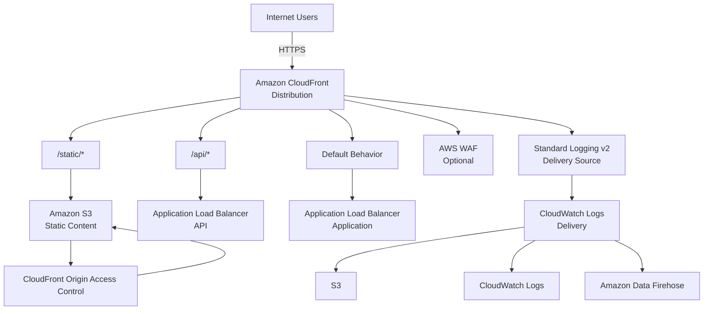
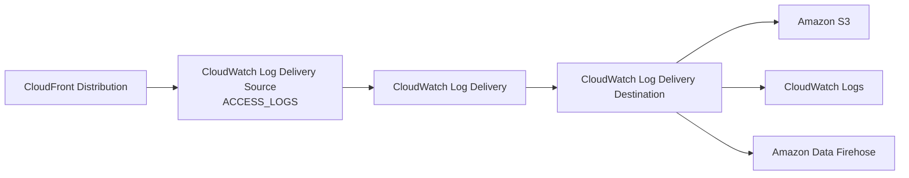
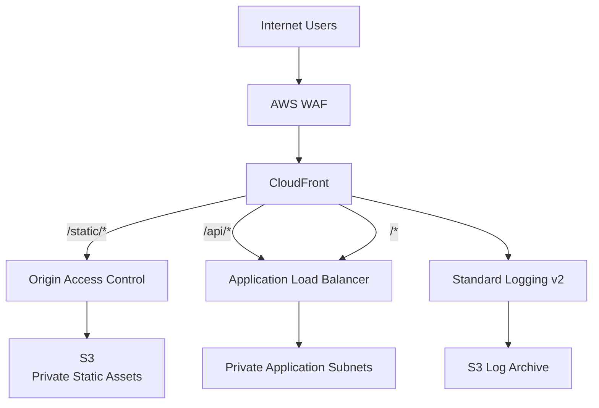

# Terraform AWS CloudFront Module

A production-oriented Terraform module for provisioning reusable **Amazon CloudFront distributions** with support for multiple origins, path-based cache behavior routing, origin failover groups, HTTPS/custom domains, AWS WAF integration, and CloudFront **Standard Logging v2**.

The module is intentionally designed around **composition rather than infrastructure ownership**. It creates and manages the CloudFront distribution and its Standard Logging v2 delivery configuration while consuming externally managed resources such as S3 buckets, Application Load Balancers, ACM certificates, WAF Web ACLs, cache policies, origin request policies, response headers policies, and logging destinations.

---

## Table of Contents

* [Overview](#overview)
* [Architecture](#architecture)
* [Core Design](#core-design)
* [Supported Capabilities](#supported-capabilities)
* [Module Structure](#module-structure)
* [Requirements](#requirements)
* [Usage](#usage)
* [Multiple Origins](#multiple-origins)
* [Cache Behaviors](#cache-behaviors)
* [Origin Groups and Failover](#origin-groups-and-failover)
* [HTTPS and Custom Domains](#https-and-custom-domains)
* [AWS WAF Integration](#aws-waf-integration)
* [Standard Logging v2](#standard-logging-v2)
* [Logging Architecture](#logging-architecture)
* [Variable Reference](#variable-reference)
* [Validation Strategy](#validation-strategy)
* [Outputs](#outputs)
* [Complete Example](#complete-example)
* [Security Considerations](#security-considerations)
* [Cost Considerations](#cost-considerations)
* [Operational Considerations](#operational-considerations)
* [Module Design Decisions](#module-design-decisions)
* [Deployment Workflow](#deployment-workflow)
* [Importing Existing Resources](#importing-existing-resources)
* [Troubleshooting](#troubleshooting)
* [Recommended Production Pattern](#recommended-production-pattern)
* [License](#license)

---

# Overview

Amazon CloudFront is an AWS content delivery network (CDN) that provides globally distributed delivery of web applications, APIs, static assets, media, and other HTTP/HTTPS content.

This module provides a reusable Terraform abstraction around `aws_cloudfront_distribution`.

The module is designed to support architectures where a single CloudFront distribution fronts multiple backend systems.

For example:

```text
                         ┌──────────────────────┐
                         │      End Users       │
                         └──────────┬───────────┘
                                    │
                                    │ HTTPS
                                    ▼
                         ┌──────────────────────┐
                         │      CloudFront      │
                         │   Global Edge CDN    │
                         └──────────┬───────────┘
                                    │
                   ┌────────────────┼────────────────┐
                   │                │                │
                   │                │                │
                   ▼                ▼                ▼
              /static/*          /api/*              /*
                   │                │                │
                   ▼                ▼                ▼
              ┌────────┐      ┌────────┐       ┌────────┐
              │   S3   │      │  ALB   │       │  ALB   │
              │ Static │      │  API   │       │  App   │
              │ Assets │      │        │       │        │
              └────────┘      └────────┘       └────────┘
```

This allows CloudFront to act as the single public entry point while different request paths are routed to the appropriate backend.

---

# Architecture

## High-Level Architecture



---

# Core Design

The module follows five major principles.

## 1. Multiple origins

The module accepts an arbitrary map of origins.

This means a distribution can contain:

* S3 origins
* ALB origins
* NLB/custom HTTP origins
* Other supported custom HTTP origins

Origins are identified using stable map keys.

For example:

```hcl
origins = {
  static = {
    ...
  }

  application = {
    ...
  }
}
```

The resulting CloudFront origin IDs are:

```text
static
application
```

Cache behaviors can then reference them directly:

```hcl
target_origin_id = "static"
```

or:

```hcl
target_origin_id = "application"
```

This is preferable to positional indexes because adding or removing an origin does not change the identity of the remaining origins.

---

# Supported Capabilities

The module currently supports:

* Multiple CloudFront origins
* S3 origins
* Custom HTTP origins
* Application Load Balancer origins
* Origin Access Control for S3
* S3 Origin Access Identity compatibility
* Default cache behavior
* Ordered cache behaviors
* Path-based origin routing
* CloudFront origin groups
* Origin failover
* Custom domain aliases
* ACM certificates
* HTTPS enforcement
* TLS protocol policy
* IPv6
* HTTP/1.1
* HTTP/2
* HTTP/2 + HTTP/3
* HTTP/3
* AWS WAF integration
* Compression
* AWS-managed cache policies
* Caller-supplied cache policies
* Caller-supplied origin request policies
* Caller-supplied response headers policies
* CloudFront Standard Logging v2
* S3 logging destinations
* CloudWatch Logs destinations
* Amazon Data Firehose destinations
* Custom tags
* Extensive Terraform variable validation
* Cross-resource validation through Terraform lifecycle preconditions

---

# Module Structure

```text
cloudfront/
│
├── .gitignore
├── README.md
├── versions.tf
├── variables.tf
├── locals.tf
├── main.tf
├── outputs.tf
│
└── examples/
    └── complete/
        ├── main.tf
        ├── variables.tf
        └── outputs.tf
```

## File Responsibilities

### `versions.tf`

Defines:

* Terraform version requirements
* AWS provider requirements

### `variables.tf`

Contains all user-configurable module inputs and validation rules.

### `locals.tf`

Contains internal values derived from module inputs.

### `main.tf`

Contains:

* CloudFront distribution
* Origins
* Origin groups
* Cache behaviors
* Viewer configuration
* WAF association
* Standard Logging v2 resources

### `outputs.tf`

Exposes useful CloudFront and logging attributes to callers.

### `examples/complete/`

Provides a complete reference implementation demonstrating:

* S3 origin
* Application origin
* Multiple cache behaviors
* HTTPS/custom domain configuration
* WAF integration
* Standard Logging v2

---

# Requirements

## Terraform

```text
>= 1.6.0
```

## AWS Provider

```text
>= 6.0.0, < 7.0.0
```

The module is intentionally constrained to the AWS provider major version 6 series to avoid unexpected breaking changes from a future provider major release.

---

# Usage

A minimal CloudFront distribution can be instantiated with one origin.

```hcl
module "cloudfront" {
  source = "git::https://github.com/iamwonodi/terraform-aws-cloudfront.git?ref=v1.0.0"

  comment = "Production CloudFront distribution"

  origins = {
    application = {
      domain_name = "example-alb.eu-west-1.elb.amazonaws.com"
      origin_type = "custom"

      custom_origin_config = {
        origin_protocol_policy = "https-only"
        origin_ssl_protocols   = ["TLSv1.2"]
      }
    }
  }

  default_cache_behavior = {
    target_origin_id = "application"
  }
}
```

The important relationship is:

```text
origins
   │
   └── application
          │
          ▼
default_cache_behavior
          │
          └── target_origin_id = "application"
```

The `target_origin_id` must reference an origin defined in `origins`.

---

# Multiple Origins

One of the primary capabilities of this module is support for multiple CloudFront origins.

A common architecture is:

```text
                    CloudFront
                        │
             ┌──────────┴──────────┐
             │                     │
       /static/*                   /*
             │                     │
             ▼                     ▼
        S3 Bucket                 ALB
```

The S3 origin serves static assets while the ALB handles dynamic application traffic.

Example:

```hcl
origins = {
  static = {
    domain_name = var.s3_origin_domain_name
    origin_type = "s3"

    origin_access_control_id = var.s3_origin_access_control_id

    s3_origin_config = {}
  }

  application = {
    domain_name = var.application_origin_domain_name
    origin_type = "custom"

    custom_origin_config = {
      http_port              = 80
      https_port             = 443
      origin_protocol_policy = "https-only"
      origin_ssl_protocols   = ["TLSv1.2"]
    }
  }
}
```

The distribution now contains two origins:

```text
static
application
```

---

# Cache Behaviors

Multiple origins become useful when combined with CloudFront cache behaviors.

CloudFront has:

1. A default cache behavior
2. Zero or more ordered cache behaviors

The default behavior handles requests that do not match an ordered behavior.

Example:

```hcl
default_cache_behavior = {
  target_origin_id = "application"
}

ordered_cache_behaviors = [
  {
    path_pattern     = "/static/*"
    target_origin_id = "static"
  }
]
```

The request flow becomes:

```text
Request
   │
   ▼
CloudFront
   │
   ├── /static/*
   │       │
   │       ▼
   │      S3
   │
   └── Everything else
           │
           ▼
          ALB
```

This is one of the main reasons the module uses a map for `origins` and a list for `ordered_cache_behaviors`.

---

# Default Cache Behavior

The default cache behavior is mandatory because CloudFront requires a default behavior.

Example:

```hcl
default_cache_behavior = {
  target_origin_id       = "application"
  viewer_protocol_policy = "redirect-to-https"

  allowed_methods = [
    "GET",
    "HEAD",
    "OPTIONS"
  ]

  cached_methods = [
    "GET",
    "HEAD"
  ]

  compress = true
}
```

The default cache policy is AWS-managed `CachingOptimized` unless another cache policy ID is supplied.

---

# Ordered Cache Behaviors

Ordered behaviors allow specific URL paths to be handled differently.

Example:

```hcl
ordered_cache_behaviors = [
  {
    path_pattern     = "/static/*"
    target_origin_id = "static"
  },

  {
    path_pattern     = "/api/*"
    target_origin_id = "application"

    allowed_methods = [
      "GET",
      "HEAD",
      "OPTIONS",
      "POST",
      "PUT",
      "PATCH",
      "DELETE"
    ]

    cached_methods = [
      "GET",
      "HEAD"
    ]
  }
]
```

This creates logical routing such as:

```text
/static/*  → S3
/api/*     → Application ALB
/*         → Application ALB
```

---

# HTTP Method Validation

The module supports the CloudFront HTTP methods:

```text
GET
HEAD
OPTIONS
PUT
POST
PATCH
DELETE
```

The module also validates that:

```text
cached_methods ⊆ allowed_methods
```

For example, this is invalid:

```hcl
allowed_methods = [
  "GET",
  "HEAD"
]

cached_methods = [
  "OPTIONS"
]
```

because `OPTIONS` is not an allowed method.

---

# Origin Groups and Failover

Origin groups provide a different capability from ordinary multiple origins.

Multiple origins are normally used for routing:

```text
/static/* → S3
/api/*    → ALB
```

Origin groups are used for failover:

```text
              Origin Group
                  │
          ┌───────┴───────┐
          │               │
       Primary         Failover
          │               │
          ▼               ▼
         ALB             S3
```

Example:

```hcl
origin_groups = {
  application_failover = {
    primary_origin_id  = "application"
    failover_origin_id = "static"

    failover_status_codes = [
      500,
      502,
      503,
      504
    ]
  }
}
```

The primary origin is used first.

If CloudFront receives one of the configured failover status codes, it can use the failover origin.

Origin groups should therefore not be confused with ordinary multi-origin routing.

---

# HTTPS and Custom Domains

The module supports optional custom domain aliases.

Example:

```hcl
aliases = [
  "www.example.com",
  "example.com"
]
```

When aliases are configured, an ACM certificate must also be supplied:

```hcl
acm_certificate_arn = var.acm_certificate_arn
```

The certificate must satisfy CloudFront's certificate requirements, including being provisioned in the required AWS region for CloudFront.

The module validates the relationship between aliases and the ACM certificate.

This prevents configurations such as:

```hcl
aliases = [
  "www.example.com"
]

acm_certificate_arn = null
```

---

# Viewer Protocol Policy

The module supports:

```text
allow-all
redirect-to-https
https-only
```

The recommended production configuration is normally:

```hcl
viewer_protocol_policy = "redirect-to-https"
```

or:

```hcl
viewer_protocol_policy = "https-only"
```

depending on the application's requirements.

---

# TLS Configuration

The module exposes:

```hcl
minimum_protocol_version
```

The default is:

```text
TLSv1.2_2021
```

This should normally be retained for modern production deployments unless compatibility requirements dictate otherwise.

---

# HTTP Version

The module supports:

```text
http1.1
http2
http2and3
http3
```

The default is:

```hcl
http_version = "http2"
```

HTTP/3 can be enabled when appropriate:

```hcl
http_version = "http3"
```

---

# IPv6

IPv6 is enabled by default:

```hcl
is_ipv6_enabled = true
```

It can be disabled if a specific compatibility requirement exists:

```hcl
is_ipv6_enabled = false
```

---

# AWS WAF Integration

The module does not create the WAF Web ACL.

Instead, it accepts an existing Web ACL ARN:

```hcl
web_acl_id = var.web_acl_id
```

This allows the WAF policy to have its own lifecycle and potentially be shared between multiple distributions or resources.

Architecture:

```text
                    Internet
                       │
                       ▼
                    AWS WAF
                       │
                 Allowed Requests
                       │
                       ▼
                  CloudFront
```

This separation keeps security policy management independent from CDN lifecycle management.

---

# Standard Logging v2

The module uses **CloudFront Standard Logging v2** rather than the legacy CloudFront logging configuration.

Logging v2 is implemented using the AWS CloudWatch Logs delivery architecture.

The module creates:

```text
aws_cloudwatch_log_delivery_source
aws_cloudwatch_log_delivery_destination
aws_cloudwatch_log_delivery
```

The destination itself remains externally managed.

---

# Logging Architecture

The logging pipeline is:



This architecture separates:

* The CloudFront log producer
* The delivery configuration
* The final destination

---

# Logging Destination Ownership

The module does **not** create the destination infrastructure.

For example, when using S3 logging, the caller is responsible for the bucket.

```text
Caller
  │
  └── S3 Bucket
          │
          ▼
CloudFront Module
  │
  ├── Log Delivery Source
  ├── Log Delivery Destination
  └── Log Delivery
```

This prevents the CloudFront module from taking ownership of unrelated storage infrastructure.

The same principle applies when the destination is:

* CloudWatch Logs
* Amazon Data Firehose

---

# Logging Configuration Example

```hcl
logging = {
  enabled = true

  source_name      = "cloudfront-access-logs-source"
  destination_name = "cloudfront-access-logs-destination"

  destination_type = "s3"
  destination_arn  = var.logging_destination_arn

  region = "us-east-1"

  output_format = "json"

  field_delimiter = ","

  record_fields = [
    "date",
    "time",
    "x-edge-location",
    "sc-bytes",
    "c-ip",
    "cs-method",
    "cs(Host)",
    "cs-uri-stem",
    "sc-status",
    "cs(Referer)",
    "cs(User-Agent)",
    "cs-uri-query",
    "cs(Cookie)",
    "x-edge-result-type",
    "x-edge-request-id",
    "x-host-header",
    "cs-protocol",
    "time-taken"
  ]

  s3 = {
    suffix_path = "/cloudfront/{DistributionId}/{yyyy}/{MM}/{dd}/{HH}"
  }
}
```

---

# Logging Destinations

The module supports these destination types:

```text
s3
cloudwatch_logs
firehose
```

The destination resource must already exist.

For S3:

```hcl
destination_type = "s3"
```

For CloudWatch Logs:

```hcl
destination_type = "cloudwatch_logs"
```

For Firehose:

```hcl
destination_type = "firehose"
```

---

# Logging Output Format

The module exposes the Standard Logging v2 output format configuration.

Supported formats include:

```text
json
plain
w3c
raw
parquet
```

Parquet is intended for S3-based delivery.

---

# Variable Reference

## `comment`

```text
Type: string
Required: yes
```

Description of the CloudFront distribution.

Example:

```hcl
comment = "Production web application CDN"
```

---

## `origins`

```text
Type: map(object)
Required: yes
```

Defines all CloudFront origins.

At least one origin must be configured.

Each origin contains:

```text
domain_name
origin_type
origin_path
origin_access_control_id
s3_origin_config
custom_origin_config
```

Supported origin types:

```text
s3
custom
```

---

## `default_cache_behavior`

```text
Type: object
Required: yes
```

Defines the default CloudFront behavior.

Important attributes include:

```text
target_origin_id
viewer_protocol_policy
allowed_methods
cached_methods
cache_policy_id
origin_request_policy_id
response_headers_policy_id
compress
```

---

## `ordered_cache_behaviors`

```text
Type: list(object)
Default: []
```

Defines path-specific cache behaviors.

Example:

```hcl
ordered_cache_behaviors = [
  {
    path_pattern     = "/static/*"
    target_origin_id = "static"
  }
]
```

---

## `origin_groups`

```text
Type: map(object)
Default: {}
```

Defines optional failover origin groups.

Each group requires:

```text
primary_origin_id
failover_origin_id
failover_status_codes
```

---

## `enabled`

```text
Type: bool
Default: true
```

Controls whether the distribution is enabled.

---

## `is_ipv6_enabled`

```text
Type: bool
Default: true
```

Controls IPv6 support.

---

## `http_version`

```text
Type: string
Default: "http2"
```

Valid values:

```text
http1.1
http2
http2and3
http3
```

---

## `price_class`

```text
Type: string
Default: "PriceClass_100"
```

Valid values:

```text
PriceClass_All
PriceClass_200
PriceClass_100
```

---

## `default_root_object`

```text
Type: string
Default: "index.html"
```

Object returned when the distribution root is requested.

---

## `aliases`

```text
Type: list(string)
Default: []
```

Alternate domain names.

Example:

```hcl
aliases = [
  "example.com",
  "www.example.com"
]
```

---

## `acm_certificate_arn`

```text
Type: string
Default: null
```

ACM certificate used for custom CloudFront aliases.

---

## `minimum_protocol_version`

```text
Type: string
Default: "TLSv1.2_2021"
```

Minimum TLS security policy for the viewer connection.

---

## `web_acl_id`

```text
Type: string
Default: null
```

Optional AWS WAF Web ACL ARN.

---

## `logging`

```text
Type: object
Default: {}
```

Controls CloudFront Standard Logging v2.

Important attributes include:

```text
enabled
source_name
destination_name
destination_type
destination_arn
region
output_format
field_delimiter
record_fields
s3
```

---

## `tags`

```text
Type: map(string)
Default: {}
```

Additional tags applied to the CloudFront distribution and supported logging resources.

---

# Validation Strategy

The module intentionally performs validation at several levels.

## Input validation

Simple constraints are validated directly inside `variables.tf`.

Examples include:

* Allowed origin types
* Valid HTTP methods
* Valid viewer protocol policies
* Valid price classes
* Valid HTTP versions
* Valid TLS policies
* Valid ports
* Valid timeout ranges
* Non-empty domains
* Unique aliases
* Valid failover status codes

---

# Cross-Variable Validation

Some relationships cannot be safely validated by examining one variable independently.

These are handled through Terraform lifecycle preconditions.

Examples include:

### Cache behavior → origin

```text
target_origin_id
        │
        ▼
must exist in
        │
        ▼
origins
```

### Origin group → origins

```text
primary_origin_id
        │
        ▼
must exist in origins
```

```text
failover_origin_id
        │
        ▼
must exist in origins
```

### Alias → ACM certificate

```text
aliases != []
       │
       ▼
ACM certificate required
```

This layered approach keeps validation comprehensive without attempting to reproduce AWS's entire API validation system inside Terraform.

---

# Outputs

The module exposes:

## `distribution_id`

CloudFront distribution ID.

```hcl
module.cloudfront.distribution_id
```

---

## `distribution_arn`

CloudFront distribution ARN.

```hcl
module.cloudfront.distribution_arn
```

---

## `distribution_domain_name`

CloudFront-generated domain name.

Example:

```text
d123456abcdef.cloudfront.net
```

Access through:

```hcl
module.cloudfront.distribution_domain_name
```

---

## `distribution_hosted_zone_id`

CloudFront hosted zone ID used when creating Route 53 alias records.

```hcl
module.cloudfront.distribution_hosted_zone_id
```

---

## `status`

Current CloudFront distribution deployment status.

```hcl
module.cloudfront.status
```

---

## `logging_delivery_source_arn`

ARN of the Standard Logging v2 delivery source.

```hcl
module.cloudfront.logging_delivery_source_arn
```

Returns `null` when logging is disabled.

---

## `logging_delivery_destination_arn`

ARN of the Standard Logging v2 delivery destination.

```hcl
module.cloudfront.logging_delivery_destination_arn
```

Returns `null` when logging is disabled.

---

# Complete Example

The `examples/complete` directory demonstrates a realistic multi-origin deployment.

The architecture is:

```text
                         Internet
                            │
                            ▼
                     ┌──────────────┐
                     │  CloudFront  │
                     └──────┬───────┘
                            │
             ┌──────────────┼──────────────┐
             │              │              │
             ▼              ▼              ▼
        /static/*        /api/*            /*
             │              │              │
             ▼              ▼              ▼
            S3             ALB             ALB
             │
             ▼
            OAC

CloudFront
    │
    ▼
Standard Logging v2
    │
    └──► S3 / CloudWatch Logs / Firehose
```

The complete example is intended to demonstrate the module's configuration rather than create every dependency required by the distribution.

---

# Security Considerations

## S3 Origins

For private S3 content, prefer:

```text
CloudFront Origin Access Control
```

rather than exposing the bucket publicly.

Recommended architecture:

```text
User
 │
 ▼
CloudFront
 │
 ▼
OAC
 │
 ▼
Private S3 Bucket
```

The S3 bucket should not need public read access.

---

# HTTPS

Production distributions should normally use HTTPS.

Recommended:

```hcl
viewer_protocol_policy = "redirect-to-https"
```

or:

```hcl
viewer_protocol_policy = "https-only"
```

---

# TLS

Use a modern TLS security policy.

The module defaults to:

```text
TLSv1.2_2021
```

Older protocol versions should only be selected where compatibility requirements justify them.

---

# WAF

For public applications, consider attaching an AWS WAF Web ACL.

The module intentionally accepts the Web ACL ARN instead of creating the WAF policy.

This permits independent security-policy management.

---

# Origin Security

CloudFront should generally communicate with origins over HTTPS where supported.

For custom origins:

```hcl
custom_origin_config = {
  origin_protocol_policy = "https-only"
  origin_ssl_protocols   = ["TLSv1.2"]
}
```

This prevents unencrypted traffic between CloudFront and the origin.

---

# Cost Considerations

CloudFront costs depend on several factors, including:

* Data transfer
* HTTP/HTTPS requests
* Edge location usage
* CloudFront features
* Origin requests
* Logging
* WAF usage
* Data storage for logs
* Firehose delivery

Standard Logging v2 can introduce additional downstream costs depending on the destination.

For example:

```text
CloudFront
    │
    ▼
Logging
    │
    ▼
S3
```

will incur the normal S3 storage and request costs associated with storing logs.

CloudWatch Logs and Firehose have their own pricing models.

Logging should therefore be enabled deliberately, especially for high-volume distributions.

---

# Operational Considerations

## CloudFront deployments are asynchronous

CloudFront distribution changes are not instantaneous.

After Terraform applies a configuration change, AWS may take time to propagate the distribution globally.

The Terraform resource remains under AWS control during this deployment process.

---

# Logging Delays

CloudFront Standard Logging v2 is not intended to provide real-time application telemetry.

Logs may take time to become available.

For real-time operational monitoring, use appropriate observability services such as:

* CloudWatch metrics
* CloudWatch alarms
* Application logs
* AWS WAF logs
* Tracing/observability systems

Logging v2 should primarily be considered an access-log delivery mechanism.

---

# Module Design Decisions

## Why does the module not create S3 buckets?

Because an S3 bucket can have a lifecycle completely independent from CloudFront.

A bucket may already be used by:

* Another distribution
* An application
* Backup infrastructure
* Data-processing workloads

Creating it inside this module would create unnecessary coupling.

---

# Why does the module not create ACM certificates?

ACM certificates have their own lifecycle and validation requirements.

The certificate may also be shared across infrastructure.

Therefore:

```text
ACM
 │
 └── externally managed
          │
          ▼
CloudFront Module
```

---

# Why does the module not create WAF Web ACLs?

WAF policies are security resources with independent lifecycle and governance requirements.

Keeping them outside the CloudFront module allows:

* Centralized WAF management
* Reuse across distributions
* Independent rule updates
* Independent security ownership

---

# Why is `origins` a map?

Using:

```hcl
origins = {
  static = { ... }
  application = { ... }
}
```

provides stable logical identifiers.

Cache behaviors can reference:

```hcl
target_origin_id = "static"
```

rather than:

```hcl
target_origin_id = origins[0]
```

This makes configurations easier to read and less sensitive to ordering changes.

---

# Why are ordered behaviors a list?

CloudFront evaluates ordered cache behaviors in a defined order.

Therefore a list is appropriate because order matters.

Example:

```hcl
ordered_cache_behaviors = [
  {
    path_pattern = "/api/private/*"
    ...
  },

  {
    path_pattern = "/api/*"
    ...
  }
]
```

The ordering can be significant and should therefore remain explicit in the caller's configuration.

---

# Why does the module use Standard Logging v2?

The module intentionally avoids the legacy CloudFront logging configuration.

Standard Logging v2 provides a more flexible delivery architecture and supports destinations beyond traditional S3 logging.

The module therefore models logging as a separate delivery pipeline rather than treating it as a simple property of the CloudFront distribution.

---

# Deployment Workflow

From the module root:

```powershell
terraform fmt -recursive
```

Then:

```powershell
terraform init
```

Validate the configuration:

```powershell
terraform validate
```

Review the planned changes:

```powershell
terraform plan
```

Apply:

```powershell
terraform apply
```

---

# Recommended Git Workflow

After validating the module:

```powershell
git status
```

Review the changes:

```powershell
git diff
```

Stage the module:

```powershell
git add .
```

Commit:

```powershell
git commit -m "feat: add cloudfront module"
```

Create the initial version tag:

```powershell
git tag -a v1.0.0 -m "Release CloudFront module v1.0.0"
```

Push the branch:

```powershell
git push origin main
```

Push the tag:

```powershell
git push origin v1.0.0
```

The module can then be consumed by another Terraform project using:

```hcl
module "cloudfront" {
  source = "git::https://github.com/iamwonodi/terraform-aws-cloudfront.git?ref=v1.0.0"

  ...
}
```

Pinning the module to a Git tag prevents an application from unexpectedly consuming future module changes.

---

# Importing Existing Resources

This module is designed primarily to create the CloudFront distribution it manages.

If an existing CloudFront distribution needs to be brought under Terraform management, it should be imported carefully.

Before importing:

1. Identify the distribution ID.
2. Ensure the Terraform configuration accurately represents the existing distribution.
3. Import the distribution into the module state.
4. Run `terraform plan`.
5. Resolve configuration drift before applying changes.

The same principle applies to existing Standard Logging v2 resources.

Do not import resources blindly.

---

# Troubleshooting

## `target_origin_id` does not exist

If Terraform reports that a cache behavior references an unknown origin, check:

```hcl
origins = {
  application = {
    ...
  }
}
```

and:

```hcl
default_cache_behavior = {
  target_origin_id = "application"
}
```

The identifiers must match exactly.

---

## Alias configured without ACM certificate

If:

```hcl
aliases = [
  "www.example.com"
]
```

is configured without:

```hcl
acm_certificate_arn = "..."
```

Terraform will reject the configuration.

Provide the appropriate ACM certificate.

---

## S3 origin configuration errors

An S3 origin must use:

```hcl
origin_type = "s3"
```

and provide the appropriate S3 origin configuration.

For private S3 origins, configure an Origin Access Control.

---

## Custom origin configuration errors

A custom origin must use:

```hcl
origin_type = "custom"
```

and provide:

```hcl
custom_origin_config = {
  ...
}
```

Do not combine S3 and custom origin configuration for the same origin.

---

## Logging destination errors

When Standard Logging v2 is enabled, verify:

* Destination ARN is correct.
* Destination type matches the destination resource.
* Destination permissions are configured correctly.
* Required AWS logging-delivery permissions exist.
* The destination exists before enabling delivery.

---

# Recommended Production Pattern

For a typical public web application, the recommended architecture is:



This provides:

* Global CDN delivery
* HTTPS
* Centralized public entry point
* WAF protection
* Private S3 content
* Application routing through an ALB
* Path-based origin selection
* Centralized access logging
* Separation between public and private infrastructure

---

# Design Philosophy

This module intentionally follows a composable infrastructure pattern.

The module owns:

```text
CloudFront Distribution
        │
        ├── Origins configuration
        ├── Cache behaviors
        ├── Viewer configuration
        ├── Origin groups
        ├── WAF association
        └── Logging delivery configuration
```

The caller owns:

```text
S3 buckets
ALBs
NLBs
ACM certificates
WAF policies
Cache policies
Origin request policies
Response headers policies
Route 53 records
Logging destinations
```

This separation keeps resource lifecycles independent and makes the module suitable for reuse across multiple environments and applications.

---

# Versioning

This module follows semantic versioning.

Example:

```text
v1.0.0
```

Terraform consumers should reference a release tag rather than an unpinned branch.

Example:

```hcl
source = "git::https://github.com/iamwonodi/terraform-aws-cloudfront.git?ref=v1.0.0"
```

Future backward-compatible changes should increment the minor version.

Breaking changes should increment the major version.

---

# License

This module is intended for reuse across Terraform infrastructure projects.

Add the repository's applicable license information here if the repository uses a specific open-source license.
